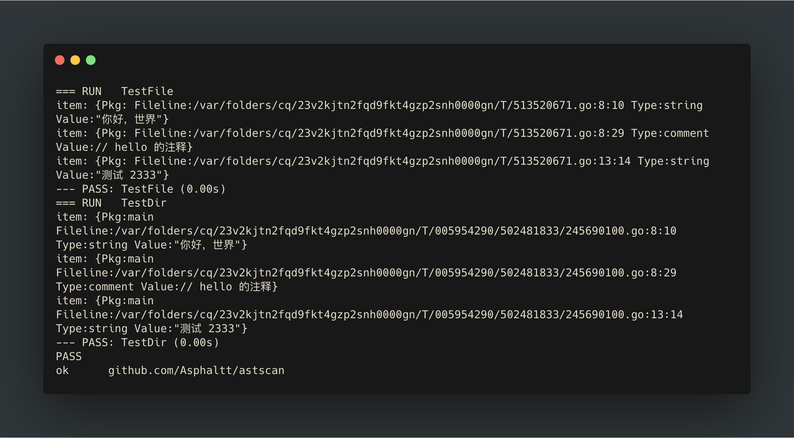

# astscan [](http://godoc.org/github.com/Asphaltt/astscan) [](https://travis-ci.org/Asphaltt/astscan)

astscan provides `File()` and `Dir()` functions. `File()` function recieves a file path and walks its AST to do `check`. If `check` is ok, it'll calls the `callback`. `Dir()` function is like `File()` but recieves a directory path, and walks the directory recursively.

# Example

```go
package astscan

import (
	"fmt"
	"io/ioutil"
	"os"
	"testing"
)

var (
	src = `// main 测试包

package main

import "fmt"

var (
	hello = "你好，世界"  // hello 的注释
)

func main() {
	fmt.Println(hello)
	fmt.Println("测试 2333")
}`
)

func _print(item Item) {
	fmt.Println("item:", item)
}

func TestFile(t *testing.T) {
	tmpFile, err := ioutil.TempFile("", "*.go")
	if err != nil {
		t.Fatal(err)
	}
	defer os.Remove(tmpFile.Name())
	defer tmpFile.Close()

	if _, err := tmpFile.Write([]byte(src)); err != nil {
		t.Fatal(err)
	}

	if err := File(tmpFile.Name(), CheckChinese, _print); err != nil {
		t.Fatal(err)
	}
}

func TestDir(t *testing.T) {
	tmpDir0, err := ioutil.TempDir("", "")
	if err != nil {
		t.Fatal(err)
	}
	defer os.RemoveAll(tmpDir0)

	tmpDir, err := ioutil.TempDir(tmpDir0, "")
	if err != nil {
		t.Fatal(err)
	}

	tmpFile, err := ioutil.TempFile(tmpDir, "*.go")
	if err != nil {
		t.Fatal(err)
	}
	defer tmpFile.Close()

	if _, err := tmpFile.Write([]byte(src)); err != nil {
		t.Fatal(err)
	}

	if err := Dir(tmpDir, CheckChinese, _print); err != nil {
		t.Fatal(err)
	}
}

```

Run `go test -v .`, you will get the output.

