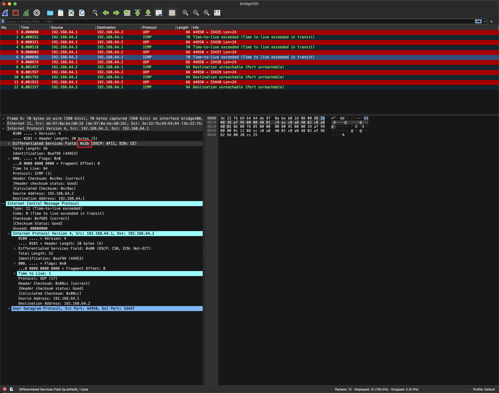

<!--
 Copyright 2023 Leon Hwang.
 SPDX-License-Identifier: MIT
-->

```
本文介绍了如何使用 XDP 来支持 traceroute 和 mtr，主要的处理逻辑是：

判断 IP 头里的 TTL 是否为 1。
干掉当前包里的 payload。
扩充包头部空间，加上 IP 头和 ICMP 头的空间大小。      
填充 IP 头并计算校验和。
填充 ICMP 头并计算校验和。
其中需要注意的地方是：计算校验和的时候，需要明确地知道用于计算校验和的包范围。
```

# XDP Traceroute

This is a simple XDP program that implements the traceroute functionality, which
can work with traceroute and mtr.

## Usage

```bash
# ./xdp-traceroute -h
Usage:
  xdp-traceroute [flags]

Flags:
      --addr string   address to traceroute, empty to retrieve from --dev
      --dev string    device to run XDP
  -h, --help          help for xdp-traceroute
```

## Example

```bash
# ./xdp-traceroute --dev enp0s1
2023/12/17 06:20:36 traceroute is running on enp0s1
```


