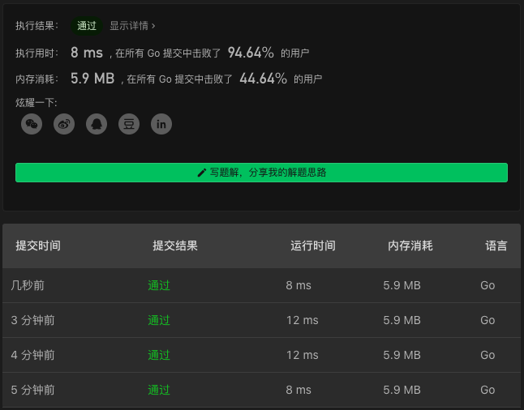

# 1018. Binary Prefix Divisible By 5

链接：https://leetcode-cn.com/problems/binary-prefix-divisible-by-5/

## 解法

被 5 整除的数字的特征是该数字的个位数是 `0` 或者 `5`，所以在遍历数组的时候，只需要保存结果的个位数即可，无需计算出完整的数字。

```go
func prefixesDivBy5(A []int) []bool {
    ans, x := make([]bool, len(A)), 0
    for i := range A {
        x = (2*x + A[i])%10
        ans[i] = x==0||x==5
    }
    return ans
}

```

### 解法效果



### 测试用例

```
[1]
[1,1]
[0,0]
[0,1,1]
[1,1,1]
[0,1,1,1,1,1]
[1,1,1,0,1]
[1,1,1,1,0,1,1,0,0,1,1,0,1,0,1,1,0,0,0,1]
```

