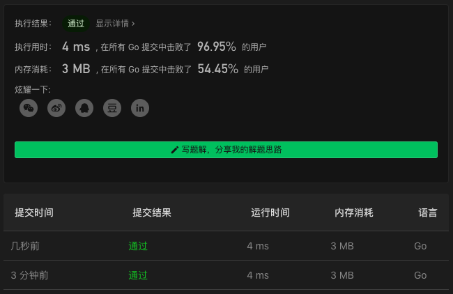

# 121. Best Time to Buy and Sell Stock

链接：https://leetcode-cn.com/problems/best-time-to-buy-and-sell-stock/

## 解法

记录当前最小价格和当前利润。遍历数组时，

当价格小于当前最小价格，则更新当前最小价格；

当利润大于当前利润，则更新当前利润。

```go
func maxProfit(prices []int) int {
    if len(prices)<2 { return 0 }
    price, profit := prices[0], 0
    for _, p := range prices[1:] {
        if p<price {
            price = p
        } else if prf := p-price; prf>profit {
            profit = prf
        }
    }
    return profit
}
```

### 解法效果

