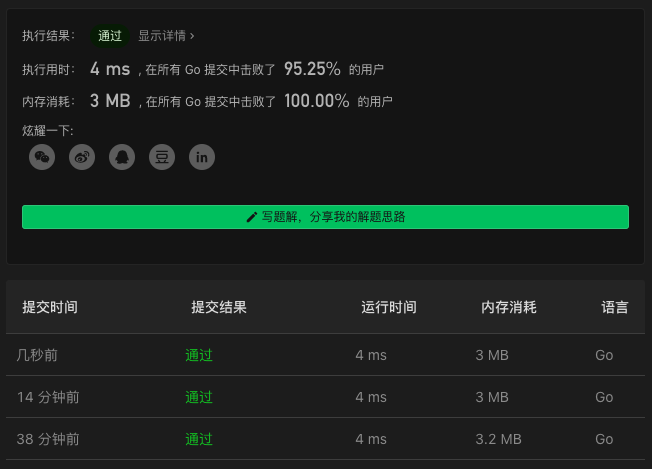

# 122. Best Time to Buy and Sell Stock II

链接：https://leetcode-cn.com/problems/best-time-to-buy-and-sell-stock-ii/

## 双指针解法

先找到当前最小值的下标，然后在找到当前最大值下标的时候，计算一次利润；重复做这个步骤。

最终，在找到当前最小值下标而没有找到当前最大值下标的时候，则当前最大值下标就是最后一个下标了。

代码如下：

```go
func maxProfit(prices []int) int {
    profit, findMin := 0, true
    minIdx, minFound := 0, false
    for i:=1; i<len(prices); i++ {
        if findMin && prices[i]>prices[i-1] {
            findMin, minIdx, minFound = false, i-1, true
            continue
        }
        if !findMin && prices[i]<prices[i-1] {
            profit += prices[i-1] - prices[minIdx]
            findMin, minIdx, minFound = true, i, false
            continue
        }
    }
    if minFound {
        return profit + prices[len(prices)-1]-prices[minIdx]
    }
    return profit
}
```

### 解法效果

