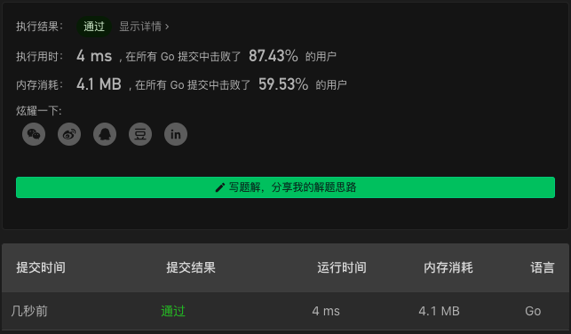

# 150. Evaluate Reverse Polish Notation

链接：https://leetcode-cn.com/problems/evaluate-reverse-polish-notation/

## 栈解法

1. 使用栈保存数字
2. 当遇到运算符时，取出两个数字进行运算，然后将结果放回栈中

```go
import "strconv"
func evalRPN(tokens []string) int {
    stack := []int{}
    for _, tok := range tokens {
        switch tok {
        case "+":
            stack[len(stack)-2] += stack[len(stack)-1]
            stack = stack[:len(stack)-1]
        case "-":
            stack[len(stack)-2] -= stack[len(stack)-1]
            stack = stack[:len(stack)-1]
        case "*":
            stack[len(stack)-2] *= stack[len(stack)-1]
            stack = stack[:len(stack)-1]
        case "/":
            stack[len(stack)-2] /= stack[len(stack)-1]
            stack = stack[:len(stack)-1]
        default:
            n, _ := strconv.Atoi(tok)
            stack = append(stack, n)
        }
    }
    return stack[0]
}
```

## 解法效果



## 测试用例

```txt
["2","1","+","3","*"]
["4","13","5","/","+"]
["10","6","9","3","+","-11","*","/","*","17","+","5","+"]
["1", "2", "+"]
["1", "2", "+","3","*"]
["11", "2", "+","-3","/"]
```

