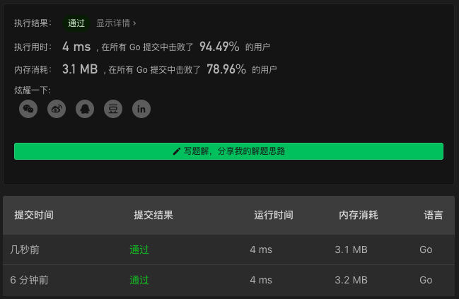

# 189. Rotate Array

链接：https://leetcode-cn.com/problems/rotate-array/

## 翻转解法

1. 翻转整个数组
2. 翻转前 k 个数字
3. 翻转 k 到结尾的数字

```go
func rotate(nums []int, k int)  {
    k = k%len(nums)
    reverse(nums)
    reverse(nums[:k])
    reverse(nums[k:])
}

func reverse(nums []int) {
    for i,j := 0, len(nums)-1; i<j; i,j=i+1,j-1 {
        nums[i], nums[j] = nums[j], nums[i]
    }
}
```

### 解法效果



### 测试用例

```
[1,2,3,4,5,6,7]
3
[-1,-100,3,99]
2
[3]
3
[1,2]
4
```

