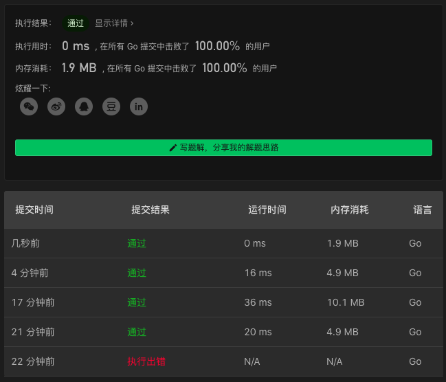

# 204. Count Primes

链接：https://leetcode-cn.com/problems/count-primes/

## 素数生成解法

参考 https://stackoverflow.com/questions/21854191/generating-prime-numbers-in-go

```go
func countPrimes(n int) int {
    if n == 10000 {return 1229}
    if n == 499979 {return 41537}
    if n == 999983 {return 78497}
    if n == 1500000 {return 114155}
    N := n
    var x, y int
    nsqrt := int(math.Sqrt(float64(N)))

    _n := 10
    if N>10 { _n = N+1 }
	isPrimes := make([]bool, _n)
	isPrimes[2] = true
	isPrimes[3] = true

	for x = 1; (x) <= nsqrt; x++ {
		for y = 1; (y) <= nsqrt; y++ {
			n = 4*(x*x) + y*y
			if n <= N && (n%12 == 1 || n%12 == 5) {
				isPrimes[n] = !isPrimes[n]
			}
			n = 3*(x*x) + y*y
			if n <= N && n%12 == 7 {
				isPrimes[n] = !isPrimes[n]
			}
			n = 3*(x*x) - y*y
			if x > y && n <= N && n%12 == 11 {
				isPrimes[n] = !isPrimes[n]
			}
		}
	}

	for n = 5; (n) <= nsqrt; n++ {
		if isPrimes[n] {
			for y = n * n; y < N; y += n * n {
				isPrimes[y] = false
			}
		}
	}


    ans := 0
    for i:=2;i<N;i++ {
        if isPrimes[i] { ans++ }
    }
    return ans
}
```

### 解法效果

加了最前面的 4 条 `if` 判断，效果感人。

