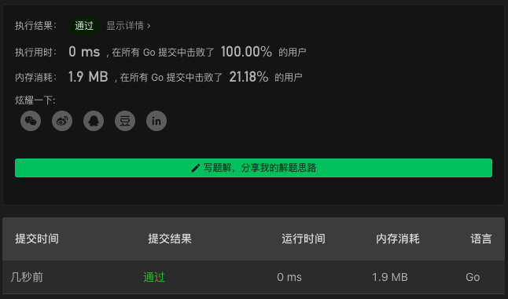

# 225. Implement Stack using Queues

链接：https://leetcode-cn.com/problems/implement-stack-using-queues/

## slice 解法

```go
type MyStack struct {
    stack []int
}


/** Initialize your data structure here. */
func Constructor() MyStack {
    return MyStack{}
}


/** Push element x onto stack. */
func (this *MyStack) Push(x int)  {
    this.stack = append(this.stack, x)
}


/** Removes the element on top of the stack and returns that element. */
func (this *MyStack) Pop() int {
    val := this.stack[len(this.stack)-1]
    this.stack = this.stack[:len(this.stack)-1]
    return val
}


/** Get the top element. */
func (this *MyStack) Top() int {
    return this.stack[len(this.stack)-1]
}


/** Returns whether the stack is empty. */
func (this *MyStack) Empty() bool {
    return len(this.stack) == 0
}


/**
 * Your MyStack object will be instantiated and called as such:
 * obj := Constructor();
 * obj.Push(x);
 * param_2 := obj.Pop();
 * param_3 := obj.Top();
 * param_4 := obj.Empty();
 */
```

## 解法效果



## 测试用例

```txt
["MyStack","push","push","top","pop","empty"]
[[],[1],[2],[],[],[]]
```

