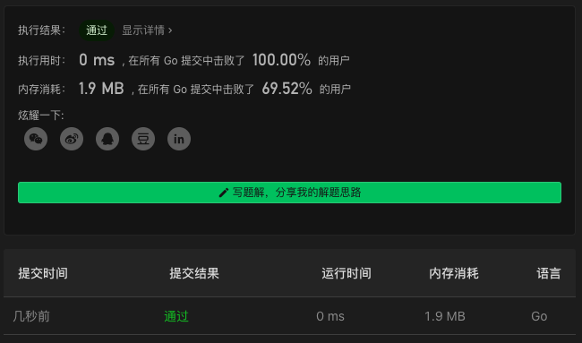

# 278. First Bad Version

链接：https://leetcode-cn.com/problems/first-bad-version/

## 二分解法

递归算法二要素：结束条件，递归计算。

这里采用了迭代的方式。

```go
/** 
 * Forward declaration of isBadVersion API.
 * @param   version   your guess about first bad version
 * @return 	 	      true if current version is bad 
 *			          false if current version is good
 * func isBadVersion(version int) bool;
 */

func firstBadVersion(n int) int {
    lo, hi := 0, n
    for lo<hi {
        if hi-lo==1 { return hi }
        mid := (lo+hi)/2
        if isBadVersion(mid) {
            hi = mid
        } else {
            lo = mid
        }
    }
    return -1
}
```

### 解法效果

