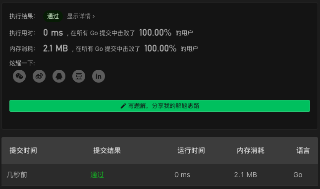

# 376. Wiggle Subsequence

链接：https://leetcode-cn.com/problems/wiggle-subsequence/

## 解法

当遇到连续相等的数字时，跳过相等的数字；

当遇到连续大于或小于当前数字的数字时，将当前数字设置为遇到的数字；

否则，将遇到的数字加入到答案中。

```go
func wiggleMaxLength(nums []int) int {
    if len(nums)<2 { return len(nums) }
    ans, cur, offset := nums[:1], 0, 1
    for i:=1; i<len(nums); i++ {
        if nums[i]!=ans[cur] {
            ans = append(ans, nums[i])
            offset = i+1
            break
        }
    }
    if len(ans)==1 { return 1 }

    cur++
    isAscending := ans[cur]>ans[cur-1]
    for i:=offset; i<len(nums); i++ {
        if nums[i]==ans[cur] { continue }
        ascending := nums[i]>ans[cur]
        if (isAscending&&ascending) || (!isAscending&&!ascending) {
            ans[cur] = nums[i]
            continue
        }

        isAscending = !isAscending
        ans = append(ans, nums[i])
        cur++
    }
    return len(ans)
}
```

### 解法效果



### 测试用例

```txt
[]
[1]
[1,1,1,1,1]
[1,1,2,1,1]
[1,7,4,9,2,5]
[1,17,5,10,13,15,10,5,16,8]
[1,2,3,4,5,6,7,8,9]
```

