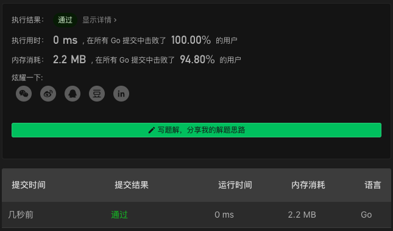

# 48. Rotate Image

链接：https://leetcode-cn.com/problems/rotate-image/

## 解法

找到旋转规律，即下方代码里的 `i`, `j`, `k` 之间的关系。

```go
func rotate(matrix [][]int)  {
    n := len(matrix)
    lst := n-1
    for i,j := 0, lst; i<j; i,j = i+1, j-1 {
        for k:=i; k<j; k++ {
            r0, c0 := k, j
            r1, c1 := j, lst-k
            r2, c2 := lst-k, lst-j
            r3, c3 := lst-j, k
            // fmt.Printf("[%d,%d] [%d,%d] [%d,%d] [%d,%d]\n", r0,c0, r1,c1, r2,c2, r3,c3)

            matrix[r0][c0], matrix[r1][c1], matrix[r2][c2], matrix[r3][c3] = matrix[r3][c3], matrix[r0][c0], matrix[r1][c1], matrix[r2][c2]
        }
    }
}
```

### 解法效果



### 测试用例

```txt
[[1]]
[[1,2],[3,4]]
[[1,2,3],[4,5,6],[7,8,9]]
[[5,1,9,11],[2,4,8,10],[13,3,6,7],[15,14,12,16]]
```

