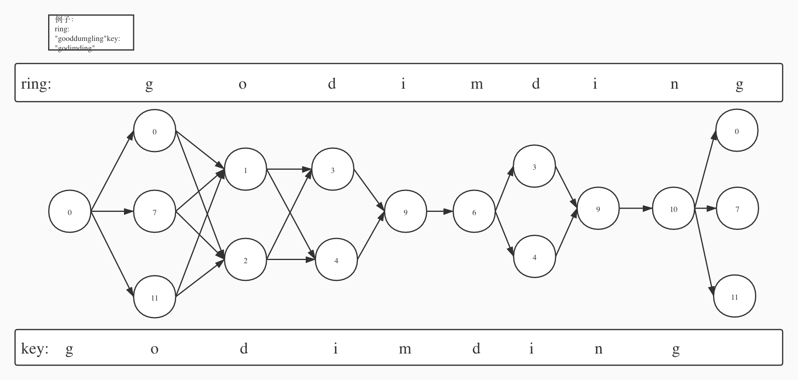
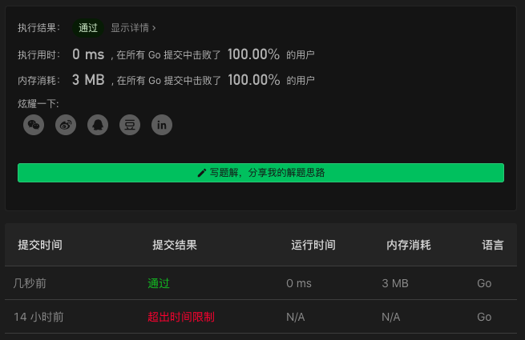

# 514. Freedom Trail

链接：https://leetcode-cn.com/problems/freedom-trail/

## 分层解法

按 `key` 进行分层，每推进一层，就计算一层所有的最短路径。

以 `ring = gooddumgling`, `key = godimding` 为例，下图从左往右看，`ring` 的每一层指的是当前层字母所在的下标，`key` 的字母指的是下一个字母所要走的下一层。从第 0 层走到 g 层时，有 3 条路径，得到 3 个最短路径；从 g 层到 o 层，有 6 条路径，最终得到 2 个最短路径；以此类推，到最后的 n 层到 g 层时，得到最终的 3 个最短路径，总的最短路径就是这 3 个最短路径中的最短的一个。



代码如下：

```go
func findRotateSteps(ring string, key string) int {
    indice := make([][]int, 26)
    for i:=0; i<len(ring); i++ {
        indice[ring[i]-'a'] = append(indice[ring[i]-'a'], i)
    }

    steps := findTrail(indice, key, []int{0}, []int{0}, len(ring))
    ans := steps[0]
    for _, a := range steps[1:] {
        ans = min(a, ans)
    }
    return ans
}

func findTrail(indice [][]int, key string, prevIdxs, prevAns []int, lng int) []int {
    curIdxs := indice[key[0]-'a']
    curAns := make([]int, len(curIdxs))
    for i, cur := range curIdxs {
        minTrail := math.MaxInt64
        for j, prev := range prevIdxs {
            var diff int
            if cur>prev {
                diff = min(cur-prev, prev+lng-cur)
            } else {
                diff = min(prev-cur, lng-prev+cur)
            }
            diff += prevAns[j]
            minTrail = min(diff, minTrail)
        }
        curAns[i] = minTrail+1
    }
    if len(key)==1 { return curAns }
    return findTrail(indice, key[1:], curIdxs, curAns, lng)
}

func min(a, b int) int {
    if a<b { return a }
    return b
}
```

### 解法效果

