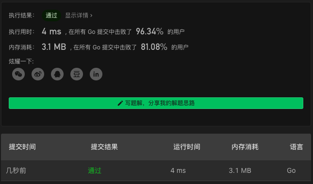

# 684. Redundant Connection

链接：https://leetcode-cn.com/problems/redundant-connection/

## 并查集解法

1. 建立并查集
2. 在遍历 `edges` 的过程中，判断当前 `edge` 的两个点都在同一个集里时，该 `edge` 就是答案

```go
func findRedundantConnection(edges [][]int) []int {
    uf := NewUnionFind(len(edges))
    for _, e := range edges {
        p1, p2 := uf.Find(e[0]), uf.Find(e[1])
        if p1 == p2 { return e }
        uf.Union(e[0], e[1])
    }
    return nil
}

type UnionFind struct {
    parents []int
}

func NewUnionFind(n int) *UnionFind {
    uf := &UnionFind{make([]int, n+1)}
    for i:=1; i<=n; i++ {
        uf.parents[i] = i
    }
    return uf
}

func (u *UnionFind) Find(i int) int {
    p := u.parents[i]
    if p == i {
        return i
    }
    p = u.Find(p)
    u.parents[i] = p
    return p
}

func (u *UnionFind) Union(x, y int) {
    u.parents[u.Find(x)] = u.Find(y)
}
```

### 解法效果



### 测试用例

```
[[1,2],[1,3],[2,3]]
[[1,2], [2,3], [3,4], [1,4], [1,5]]
```

