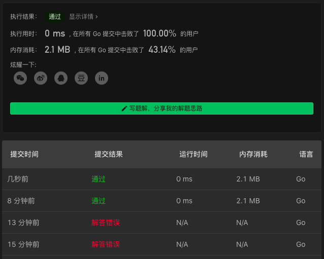

# 842. Split Array into Fibonacci Sequence

链接：https://leetcode-cn.com/problems/split-array-into-fibonacci-sequence/

## 回溯解法

第一步：找到第一个数

第二步：寻找第二个数

第三步：使用前面两个数去确定下一个 Fibonacci 数

> 本题边界条件比较多，稍不注意就会漏掉一些边界条件的处理。
>
> 比如：`0000`, `0224`, `539834657215398346785398346991079669377161950407626991734534318677529701785098211336528511`（数值会超过最大 32 位有符号整数  2<<32-1）

```go
import "strconv"
func splitIntoFibonacci(S string) []int {
    if len(S) < 3 { return nil }
    if S[0]=='0' {
        fibs, _ := rangeSecond(S[1:], 0)
        return fibs
    }

    for i:=1; i<len(S); i++ {
        a, _ := strconv.Atoi(S[:i])
        if a>math.MaxInt32 { return nil }
        fibs, ok := rangeSecond(S[i:], a)
        if ok { return fibs }
    }
    return nil
}

func rangeSecond(s string, a int) ([]int, bool) {
    for j:=1; j<len(s); j++ {
        b, _ := strconv.Atoi(s[:j])
        if b>math.MaxInt32 { return nil, false }
        fibs, ok := nextFibonacci(s[j:], a, b, []int{a, b})
        if ok { return fibs, true }
    }
    return nil, false
}

func nextFibonacci(s string, a, b int, fibs []int) ([]int, bool) {
    c := a+b
    if c>math.MaxInt32 { return nil, false }
    str := strconv.Itoa(c)
    // fmt.Println("s:", s, "a:", a, "b:", b, "c:", c)
    if len(s)<len(str) || s[:len(str)] != str { return nil, false }
    fibs = append(fibs, c)
    if len(s)==len(str) { return fibs, true }
    return nextFibonacci(s[len(str):], b, c, fibs)
}
```

### 解法效果



### 测试用例

```txt
"31326395158253411"
"539834657215398346785398346991079669377161950407626991734534318677529701785098211336528511"
"0000"
"0224"
"0111122"
"112358130"
"0"
"1"
"01"
"11"
"12"
"112"
"011"
"012"
"11112233"
"123456579"
"121123"
"1292130"
"11235813"
"1101111"
"0123"
```

