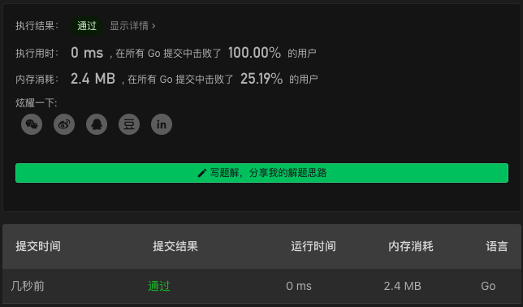

# 86. Partition List

链接：https://leetcode-cn.com/problems/partition-list/

## 双指针解法

一个链表保存小于 `x` 的节点，另一个链表保存大于等于 `x` 的节点。

```go
/**
 * Definition for singly-linked list.
 * type ListNode struct {
 *     Val int
 *     Next *ListNode
 * }
 */
func partition(head *ListNode, x int) *ListNode {
    rootLeft, rootRight := &ListNode{}, &ListNode{}
    pl, pr := rootLeft, rootRight
    for p:=head; p!=nil; p=p.Next {
        if p.Val<x {
            pl.Next, pl = p, p
        } else {
            pr.Next, pr = p, p
        }
    }

    pr.Next = nil // 防止形成环
    pl.Next = rootRight.Next
    return rootLeft.Next
}
```

### 解法效果



### 测试用例

```
[1,4,3,2,5,2]
3
```

