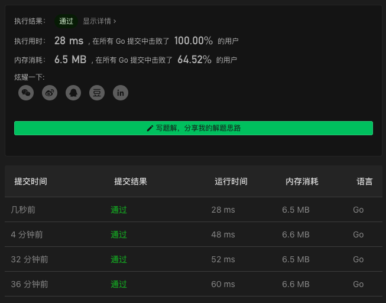

# 976. Largest Perimeter Triangle

链接：https://leetcode-cn.com/problems/largest-perimeter-triangle/

## 贪心解法

不断地使用冒泡排序算法找到最大的数字，然后判断最大的三个数字是否满足条件。

```go
func largestPerimeter(A []int) int {
    lng := len(A)
    idx := lng-3
    bubble(A)
    bubble(A[:lng-1])
    bubble(A[:lng-2])
    for ; idx>=0; idx-- {
        a, b, c := A[idx], A[idx+1], A[idx+2]
        if a+b>c {
            return a+b+c
        }
        bubble(A[:idx])
    }
    return 0
}

func bubble(arr []int) {
    if len(arr)==0 { return }
    a, idx := arr[0], 0
    for i:=1; i<len(arr); i++ {
        if arr[i]>a {
            a, idx = arr[i], i
        }
    }
    lst := len(arr)-1
    arr[idx], arr[lst] = arr[lst], arr[idx]
}
```

### 解法效果

