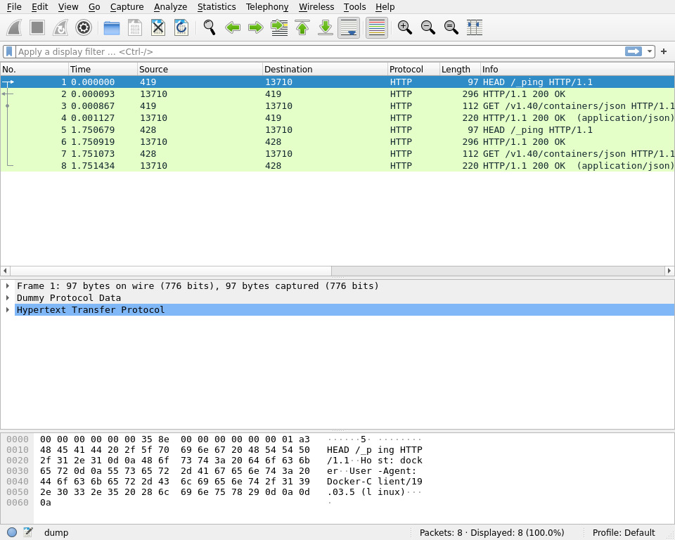

# sockdump

Dump unix domain socket traffic.

Supports STREAM and DGRAM types.

## Usage

```bash
# ./sockdump -h
Usage of ./sockdump:
      --format string         output format (string, hex, hexstring, pcap) (default "hex")
      --output string         output file, default stdout
      --pid uint              pid of the process to trace
      --seg-size uint         max segment size, increase this number if packet size is longer than captured size (default 51200)
      --segs-in-buffer uint   max number of segs in perf event buffer, increate this number if message is dropped (default 100)
      --segs-per-msg uint     max number of iovec segments (default 10)
      --sock string           unix socket path.
                              Matches all sockets starting with the given path.
                              Note that the path must be the same string used in the application, instead of the actual file path.
                              If the application used a relative path, the same relative path should be used here.
                              If the application runs inside a container, the path inside the container should be used here.
pflag: help requested
```

**Note**: `sockdump` match `--sock` as prefix, so `/tmp/sockdump` will match like `/tmp/sockdump*`. And empty `--sock` will match all sockets.

## Example

### string output

```bash
# echo "go run ./cmd/sockdump-example/main.go" in another terminal
# ./sockdump --format string
2023/12/08 12:21:37 Attached fentry to unix_stream_sendmsg
2023/12/08 12:21:37 Attached fentry to unix_dgram_sendmsg
2023/12/08 12:21:37 Read data from perf event...
2023-12-08 12:21:39 >>> process sockdump-exampl [48125 -> 48125] path /tmp/sockdump.sock len 86(86)
GET // HTTP/1.1
Host: unix
User-Agent: Go-http-client/1.1
Accept-Encoding: gzip


2023-12-08 12:21:39 >>> process sockdump-exampl [48125 -> 48125] path /tmp/sockdump.sock len 944(944)
HTTP/1.1 200 OK
Content-Type: text/html; charset=utf-8
Last-Modified: Fri, 08 Dec 2023 12:21:39 GMT
Date: Fri, 08 Dec 2023 12:21:39 GMT
Content-Length: 781

<pre>
<a href=".ICE-unix/">.ICE-unix/</a>
<a href=".X11-unix/">.X11-unix/</a>
<a href=".XIM-unix/">.XIM-unix/</a>
<a href=".font-unix/">.font-unix/</a>
<a href="snap-private-tmp/">snap-private-tmp/</a>
<a href="systemd-private-9dda0a49b49843b994907c3790385fd7-systemd-logind.service-atspfy/">systemd-private-9dda0a49b49843b994907c3790385fd7-systemd-logind.service-atspfy/</a>
<a href="systemd-private-9dda0a49b49843b994907c3790385fd7-systemd-resolved.service-0mw7GZ/">systemd-private-9dda0a49b49843b994907c3790385fd7-systemd-resolved.service-0mw7GZ/</a>
<a href="systemd-private-9dda0a49b49843b994907c3790385fd7-systemd-timesyncd.service-n6Px1k/">systemd-private-9dda0a49b49843b994907c3790385fd7-systemd-timesyncd.service-n6Px1k/</a>
<a href="sockdump.sock">sockdump.sock</a>
</pre>

^C
2023/12/08 12:21:40 Captured 2 packets
```

### pcap output

```bash
# ./sockdump --format pcap --output sockdump.pcap
2023/12/08 12:45:37 Attached fentry to unix_stream_sendmsg
2023/12/08 12:45:37 Attached fentry to unix_dgram_sendmsg
2023/12/08 12:45:37 Read data from perf event...
^C
2023/12/08 12:45:41 Captured 2 packets
# wireshark -X lua_script:wireshark/dummy.lua dump

# echo On macOS, you should
# /Applications/Wireshark.app/Contents/MacOS/Wireshark -X lua_script:wireshark/dummy.lua sockdump.pcap
```



## License

**Unlicense** for Go code.

**BSD** and **GPL** license for bpf C code.
